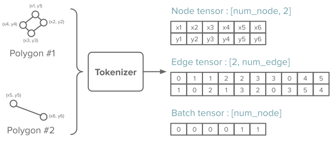
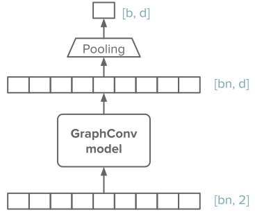

# Graph-based

## General

In this model, the polygon's coordinates are represented as nodes of a graph, and the model is using Graph convolutions to learn the features of the polygons.

This model is implemented using the `pytorch-geometric` package.

## Installation

You need to install the `cartesius` package with the extra dependency `graph` (see [Extra dependencies](../index.md#extra-dependencies) for more details).

You also need to manually install the right versions of `torch-scatter` and `torch-sparse` (compatible with your current `torch` version). You can do so by running :

```bash
pip install torch-scatter torch-sparse -f https://data.pyg.org/whl/torch-$(python -c "import torch; print(torch.__version__)").html
```

## Tokenization

The polygon is represented as a graph, where each **node** is a point of the polygon. The graph is **unweighted** and **undirected**.

The `pytorch-geometric` library takes care of batching graphs together correctly (more details on graph mini-batching in [their documentation](https://pytorch-geometric.readthedocs.io/en/latest/notes/batching.html))



## Feature extraction

Then the model pass through several layers of Graph convolutions, and the features of each node are pooled (average pooling) to give the polygon representation.

{ width="400" }
