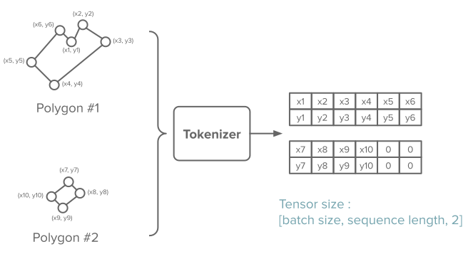
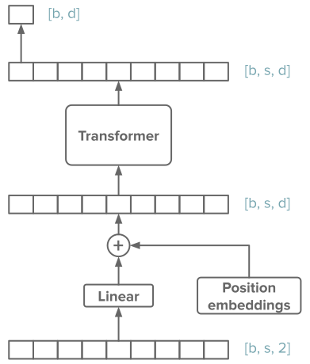

# Transformer

## General

This model is using a **Transformer** to extract features from the raw polygon's coordinates.

!!! info
    It uses the **official Pytorch** implementation of Transformer.

## Tokenization

The polygon's coordinates are simply put along the sequence dimension.

If the batch contains polygons with different number of points, tensors are padded appropriately.

## Feature extraction

Tokens are then embedded, and fed into the Transformer.

{ width="400" }

The representation of the first token is used as representation for the whole polygon.

!!! question
    Using the first token as representation for the whole polygon might not be the best strategy. But it's simple at least !  
    Feel free to experiment other approaches.
