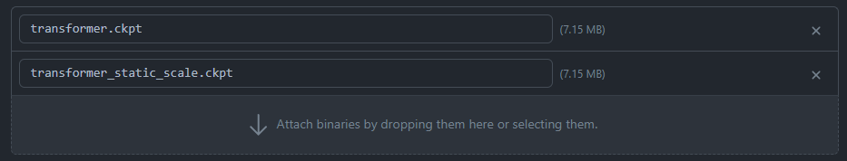
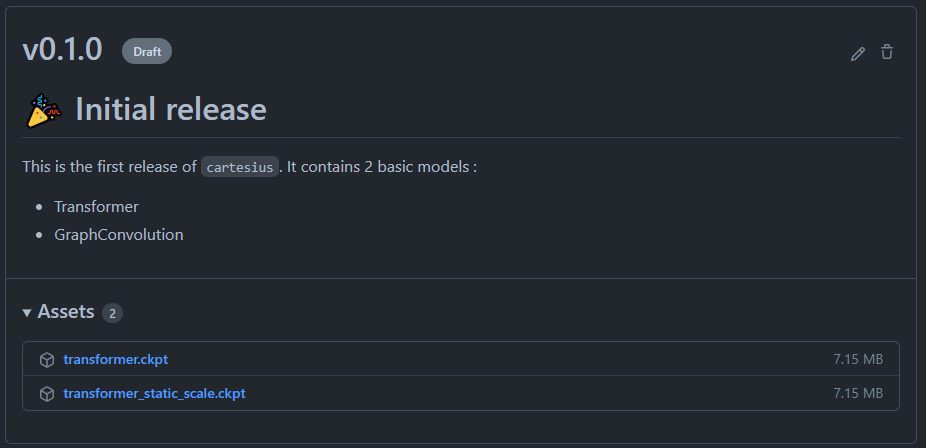

# Upload your trained checkpoint

After training your model, you want to upload your checkpoint somewhere to make it available to others, for reproducibility.

Checkpoints are **not** something that we want to version-control, so we should **not** upload them to Github.

Instead, we can upload them as **Release assets**.

## Adding a release asset

Go to the [Release page](https://github.com/TeamSPWK/cartesius/releases) of cartesius.

Pick the release where you want to add your asset (the best practice is to select the **latest draft** release).

Click on the "edit" button to edit the release.

You can now drag-and-drop your checkpoint to upload it as a release asset :

Don't forget to save your changes ("save draft" button).

## Getting the download link

After uploading your checkpoint as a release asset, you should be able to see it from the [Release page](https://github.com/TeamSPWK/cartesius/releases) of cartesius, under "Assets".

Each asset is clickable and the link is the download link. You can copy this link, to save it in the leaderboard for example.
